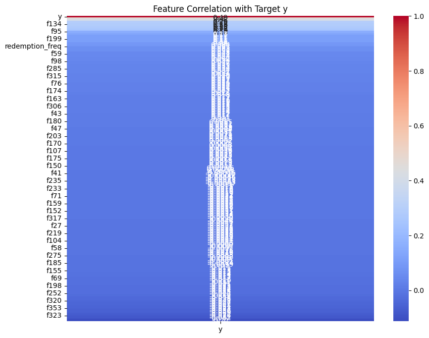

<h1 align="center">Offerings Personalization: A Predictive Approach</h1>
<h4 align-center">AMEX Decision Science Track 2025 Campus Challenge</h4>

  
  
  
  

## Project Overview
This project was developed for the **American Express Decision Science Track 2025** campus challenge. The primary objective is to enhance the personalization of customer offerings by developing a robust predictive model. This model estimates the probability of a customer clicking on a specific offer, enabling more effective and targeted marketing campaigns. By accurately identifying customers who are most likely to engage, the solution aims to improve conversion rates and optimize marketing spend.

---

## Methodology
The approach involved a comprehensive workflow, from data wrangling and feature engineering to model training and evaluation.

### 1. Data Processing & Feature Engineering
The initial phase focused on preparing the data for modeling.
* **Data Integration**: Two separate datasets, containing customer transactional history and offer details, were used. These were merged on unique customer IDs to create a unified view for analysis.
* **Feature Creation**: New, insightful features were engineered from the raw data to better capture customer behavior and offer characteristics, providing richer inputs for the predictive models.

### 2. Exploratory Data Analysis (EDA)
An extensive EDA was performed to understand the underlying patterns, distributions, and relationships within the data. This involved visualizing feature distributions to check for skewness and identifying outliers that could impact model performance.

*Histograms show the right-skewed nature of many numerical features.*

### 3. Feature Selection
To build an efficient and effective model, a systematic feature selection process was employed.
* **Initial Filtering**: A correlation analysis was conducted to identify features with the strongest relationship to the target variable (customer click). The top 50 most correlated features were initially selected.
* **Importance-Based Refinement**: A **Random Forest Classifier** was then used to evaluate the importance of these 50 features. This allowed for further refinement, narrowing the set down to the **top 20 most predictive features**.

*The heatmap was used to visualize the correlation of various features with the target variable 'y'.*

### 4. Model Training and Evaluation
Several machine learning models were trained on both the top 50 and top 20 feature sets to identify the best performer. The models evaluated include:
* **Logistic Regression**
* **XGBoost**
* **LightGBM**

The models were assessed based on their predictive accuracy and computational efficiency.

---

## Results & Conclusion
The gradient boosting models demonstrated superior performance, with a **maximum training accuracy of approximately 98%** achieved. The final model proves highly effective in predicting customer click probability.

*The pair plot illustrates the relationships between the most predictive features and the binary target variable.*

By leveraging this predictive model, American Express can significantly improve its customer engagement strategy. The solution allows for data-driven personalization, ensuring that the right offers are sent to the right customers at the right time, thereby maximizing the return on investment for marketing initiatives.

---

## Tools and Libraries
* **Language**: Python
* **Core Libraries**: Pandas, NumPy, Scikit-learn
* **Visualization**: Matplotlib, Seaborn
* **Modeling**: XGBoost, LightGBM
* **Environment**: Jupyter Notebook
